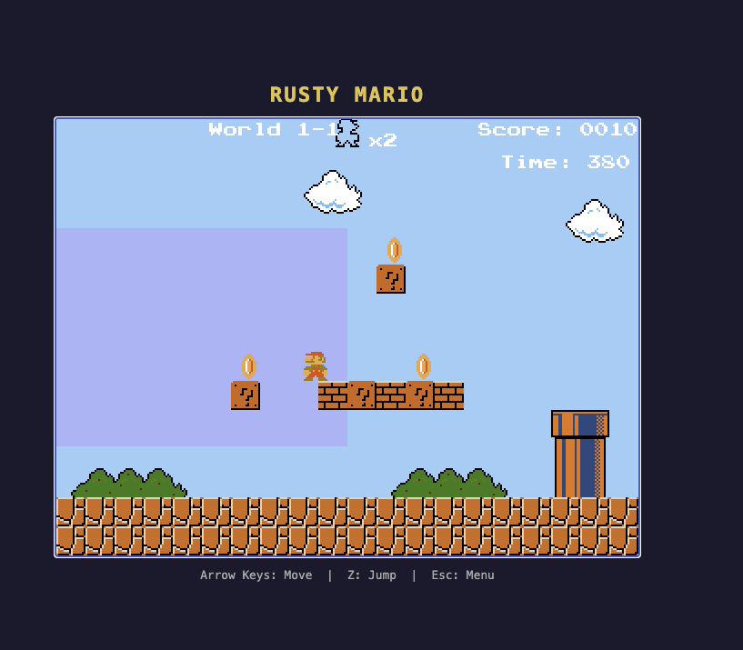

# Rusty Mario



A faithful Rust port of the classic **Super Mario Python** — built with the [Bevy](https://bevyengine.org/) game engine and compiled to **WebAssembly**, so the exact same binary runs natively on your desktop or directly in any modern browser with zero install.

---

## About

**Super Mario Python** (originally published on [SourceForge](https://sourceforge.net/projects/supermariobrosp/)) was a clean, readable Python implementation of the classic Mario platformer. It served as both a playable game and an approachable study in game-loop design.

**Rusty Mario** takes that foundation and ports it faithfully to Rust, preserving the level layouts, sprite art, enemies, and feel of the original — while gaining:

- **Native performance** via Rust and Bevy 0.15
- **Browser-native play** via a single `wasm32-unknown-unknown` build target
- **No runtime dependency** — ship a single `.wasm` file + assets

---

## Features

- Four hand-crafted levels with the original tile layouts
- Mario physics: run, jump, stomp
- Enemies: Goombas, Koopas, Bowser with fireballs
- Items: coins, mushrooms, super star
- Background music and sound effects
- HUD with lives, coins, and score
- Clean Bevy ECS architecture — easy to extend

---

## Play in the browser

The latest build is served from `dist/`. To try it locally:

```bash
cd dist
python3 -m http.server 8080
# open http://localhost:8080
```

Controls:

| Key | Action |
|-----|--------|
| Arrow Left / Right | Move |
| Z | Jump |
| Esc | Menu |

---

## Run natively

```bash
cargo run --release
```

Requires a stable Rust toolchain (1.80+). No other setup needed — Cargo pulls all dependencies.

---

## Build for the browser (WASM)

```bash
./build_wasm.sh
```

The script:
1. Adds the `wasm32-unknown-unknown` target (if missing)
2. Compiles with the `wasm-release` profile (fat LTO, size-optimised)
3. Runs `wasm-bindgen` to generate JS bindings
4. Copies assets and `index.html` into `dist/`

Outputs land in `dist/` — upload that directory to any static host (GitHub Pages, Netlify, Cloudflare Pages) and the game is live.

> **Tip:** If you use `wasm-opt` locally it will be picked up automatically for an extra size reduction.

---

## Development

```bash
# fast iteration — no WASM tooling needed
cargo run

# check everything compiles for WASM without a full bindgen pass
cargo check --target wasm32-unknown-unknown

# full WASM build
./build_wasm.sh
```

### Project layout

```
src/
  main.rs          — app setup, plugin registration
  states.rs        — GameState enum (Loading, Menu, Playing, GameOver)
  components.rs    — ECS component types
  constants.rs     — tile size, gravity, speeds, …
  player.rs        — input handling, Mario state machine
  enemies.rs       — Goomba / Koopa / Bowser AI
  items.rs         — coins, mushrooms, star
  level.rs         — level loading from PNG tile maps
  physics.rs       — AABB collision resolution
  camera.rs        — side-scrolling camera follow
  game_assets.rs   — asset loading / handles
  ui.rs            — HUD rendering
  audio.rs         — music and SFX

assets/
  levels/          — lvl1.png … lvl4.png (tile-encoded level maps)
  sprites/         — all sprite sheets
  audio/           — music tracks and sound effects
  fonts/           — bitmap font

index.html         — browser shell (canvas + CLICK TO PLAY overlay)
build_wasm.sh      — one-shot WASM build script
```

### Key architecture notes

- Levels are encoded as PNG images. Each pixel colour maps to a tile type — see `level.rs` and `constants.rs` for the palette.
- Physics uses a straightforward AABB solver in `physics.rs`; Bevy's built-in collision is not used.
- The `webgl2` feature flag is the only Bevy feature enabled — keeping the WASM binary small.

---

## Prerequisites

| Tool | Notes |
|------|-------|
| [Rust stable](https://rustup.rs/) | 1.80 or newer |
| `wasm32-unknown-unknown` target | `rustup target add wasm32-unknown-unknown` |
| [wasm-bindgen-cli](https://github.com/rustwasm/wasm-bindgen) | `cargo install wasm-bindgen-cli` — only for WASM builds |
| [wasm-opt](https://github.com/WebAssembly/binaryen) | Optional, for extra size reduction |

---

## Contributing

Contributions are very welcome! The codebase is intentionally kept readable and close to the original Python structure, so it is a great place to learn Bevy and Rust game development.

Ideas for good first contributions:
- Fix an existing [issue](../../issues) or file a new one
- Add missing levels or enemy types from the original
- Improve the pixel-art rendering (nearest-neighbour scaling, CRT shader)
- Mobile / touch controls for the browser version
- A level-editor that writes the PNG tile format
- CI/CD that publishes `dist/` to GitHub Pages on every merge

Fork the repo, make your changes, and open a pull request. Please keep PRs focused — one feature or fix at a time makes review easy.

---

## Credits

- **Original game:** Super Mario Python — [sourceforge.net/projects/supermariobrosp](https://sourceforge.net/projects/supermariobrosp/)  
  All level design, sprite art, and sound assets originate from that project. This port exists to give the game a second life in the browser.
- **Engine:** [Bevy](https://bevyengine.org/) — the data-driven Rust game engine
- **Rust port:** Arjan Franzen

---

## License

This project is released under the **GNU General Public License v3.0** — see [LICENSE](LICENSE) for the full terms. Forks and modifications must be distributed under the same licence.

The original **Super Mario Python** assets (sprites, audio, level maps, and level designs) originate from the [upstream project](https://sourceforge.net/projects/supermariobrosp/) — please consult that project's licence before redistribution.
